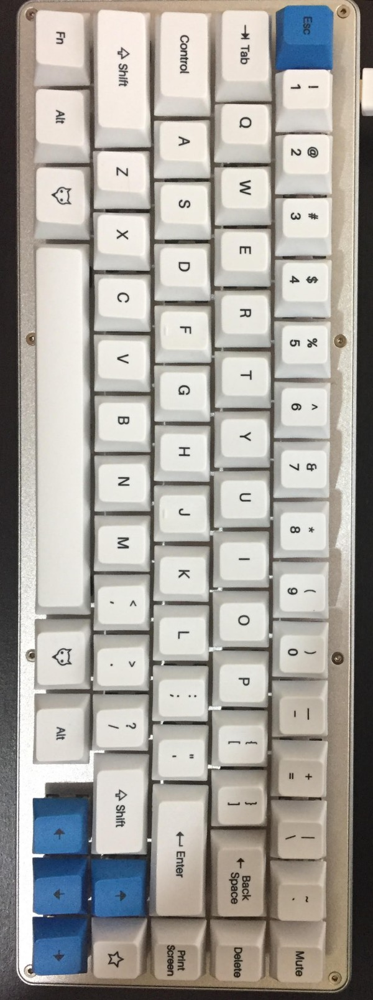

this is my configuration for my Whitefox and Nightfox keyboards, produced by Imput Club. My layout is based largely on the classic Happy Hacking keyboard, with a few additional features enabled by the additional column on the right side.

Currently, I'm experimenting with raised keys over on the right like Delete and PrScr, we'll see where that lands. Mute is prominent because...well, sometimes your computer just needs to STFU immediately. Other audio controls are in layer one, accessed by the lower function key. Layer 2 is the place to access other layers, accessed by using the Star key, which will put your machine down for a nap in Layer 1.

