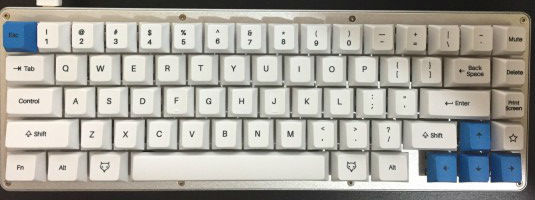

this is my configuration for my Whitefox and Nightfox keyboards, produced by Imput Club. My layout is based largely on the classic Happy Hacking keyboard, with a few additional features enabled by the additional column on the right side.

Currently, I'm experimenting with raised keys over on the right like Delete and PrScr, we'll see where that lands. Mute is prominent because...well, sometimes your computer just needs to STFU immediately. Other audio controls are in layer one, accessed by the lower function key. Layer 2 is the place to access other layers, accessed by using the Star key, which will put your machine down for a nap in Layer 1.

Not included in the images, this version enables vi-style keys for 'browser mode' in layers 3 & 4. 

## Layer Notes
### Layer 1:
Function Layer
- Function keys and a few other action keys:
- 1-0 = F1-F10
- Esc = Lock-1 (subject to change)
- - = vol-
- = = vol+
- \ = Play
- ` = Pause
- Del = Stop
- [ = Prev
- ] = Next
- Up = PGUP
- Down = PGDN
- Right = End
- Left = Home
- Star = Sleep

### Layer 2:
Locking Layer
- 1-7 = Lock-1 - Lock-7

### Layer 3:
Browsing Layer
- j = down arrow
- k = up arrow
- h = left arrow
- l = right arrow
- Media Controls as Layer 1
- the left shift key is the modifier to enable layer 4:

### Layer 4:
Browsing modifier layer
- j = page down
- k = page up
- h = home
- l = end
- Also explicitly reset the media and sleep keys in 3 and 4 in a hopefully sensible manner.

### Notes
Discovered that f1 does not send to main...so couldn't get back to typing. Now f1-ESC and f2-ESC both do None layers.

That didn't work...so still not able to escape from "web mode"

Discovered that None does not accomplish None in a layer sense, but more in a no-op sense. To unset a lock, do the lock again.

Cleaned up a few keys, Tab is now always tab, and ESC is a way out of Lock-1. 

I should probably remove Lock-1 from Layer 2 as Layer 1 is intended as just a modifier layer.

